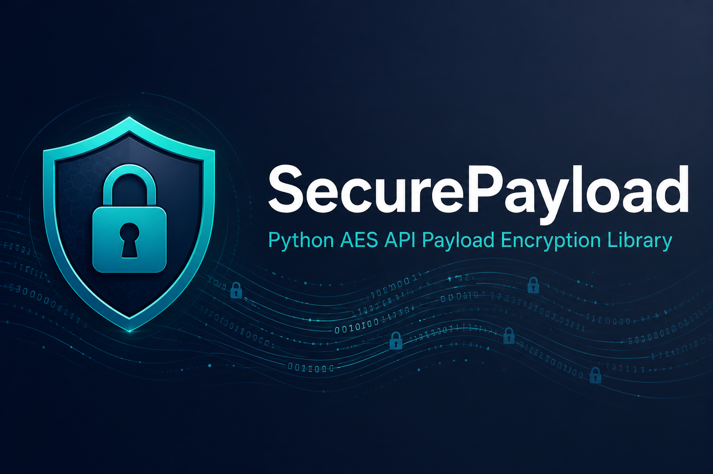

<p align="center">
  
</p>

<p align="center">
  
</p>

<h1 align="center">SecurePayload</h1>

<p align="center">
  <strong>Python AES encryption library for secure API payload handling</strong>
</p>

<p align="center">
  Encrypt and decrypt JSON API payloads, webhook bodies, and request data with a simple two-call API —
  <code>securepayload.encrypt()</code> and <code>securepayload.decrypt()</code>
</p>

<p align="center">
  <a href="#installation">Installation</a> •
  <a href="#quick-start">Quick Start</a> •
  <a href="#usage">Usage</a> •
  <a href="#api-reference">API Reference</a> •
  <a href="#testing">Testing</a>
</p>

<p align="center">
  
  
  
</p>

---

## Overview

**SecurePayload** is a lightweight Python cryptography library built for developers who need to **encrypt API request bodies** and **decrypt encrypted webhook or HTTP payloads**. It uses AES-128-ECB with PKCS#7 padding and Base64 output — compatible with existing encrypted API integrations.

Ideal for:

- Python microservices sending encrypted API requests
- Webhook receivers decrypting incoming payloads
- Background workers and ETL pipelines handling secure JSON data
- Integration scripts bridging encrypted API endpoints

```python
import securepayload

securepayload.bootstrap()

encrypted = securepayload.encrypt({"order_no": "m123", "channel": "CARD"})
decrypted = securepayload.decrypt(encrypted)
```

---

## Features

| Feature | Description |
|---------|-------------|
| **Simple API** | `securepayload.encrypt()` and `securepayload.decrypt()` — minimal boilerplate |
| **API payload ready** | JSON dicts and lists encrypted automatically |
| **Environment-based keys** | Configure via `securepayload.bootstrap()` or `configure(key=...)` |
| **Selective field encryption** | `Aes.obj_pipe()` for encrypting individual record fields |
| **Typed exceptions** | `InvalidKeyError`, `EncryptionError`, `DecryptionError` |

---

## Requirements

- Python **3.9+**
- [PyCryptodome](https://pycryptodome.readthedocs.io/)
- [python-dotenv](https://github.com/theskumar/python-dotenv)

---

## Installation

### From PyPI

```bash
pip install securepayload
```

### From source (development)

```bash
git clone https://github.com/zfhassaan/securepayload.git
cd securepayload
python -m venv env

# Windows
env\Scripts\activate

# macOS / Linux
source env/bin/activate

pip install -e ".[dev]"
```

### Configure your AES key

Create a `.env` file (or set the variable in your environment):

```env
SECURITY_AES_KEY=your-16-char-key
```

> **Security:** Never commit production keys. Keep `.env` out of version control.

---

## Quick start

```python
import securepayload

securepayload.bootstrap()  # loads .env and configures the key

payload = {"order_no": "26168785012837", "channel": "CARD"}

encrypted = securepayload.encrypt(payload)
decrypted = securepayload.decrypt(encrypted)

print(encrypted)   # Base64 ciphertext
print(decrypted)   # Original dict
```

```bash
python examples/basic_usage.py
```

---

## Usage

### Encrypt and decrypt API payloads

```python
import securepayload

# Load key from .env (searches upward from cwd)
securepayload.bootstrap()

# Or pass key explicitly
securepayload.configure(key="your-16-char-key")

# Encrypt JSON payload → Base64 string
ciphertext = securepayload.encrypt({"order_no": "m123", "channel": "CARD"})

# Decrypt → dict (auto JSON-parsed)
data = securepayload.decrypt(ciphertext)
```

| Input to `decrypt()` | Result |
|----------------------|--------|
| Base64 `str` | Decrypted; JSON-parsed when valid JSON |
| `dict` / `list` | Returned unchanged |
| Other | `None` |

### HTTP integration

```python
import os
import requests
import securepayload

securepayload.configure(key=os.environ["SECURITY_AES_KEY"])

body = securepayload.encrypt({"event": "order.updated", "order_no": "m123"})
requests.post("https://api.example.com/webhook", data=body)
```

### Error handling

```python
import securepayload
from securepayload.exceptions import DecryptionError, InvalidKeyError

try:
    securepayload.configure(key="")
except InvalidKeyError:
    ...

try:
    securepayload.decrypt("invalid-ciphertext")
except DecryptionError:
    ...
```

### Advanced: selective field encryption

```python
from securepayload import Aes

aes = Aes(key="your-16-char-key")
record = {"name": "public", "token": "secret-value"}
sealed = aes.obj_pipe(record, mode=1, props=["token"])
```

---

## Examples

| Script | Description |
|--------|-------------|
| `examples/basic_usage.py` | Encrypt/decrypt demo |
| `examples/vector_test.py` | Known ciphertext vector validation |
| `examples/run_tests.py` | Runs the pytest suite |

```bash
python examples/basic_usage.py
python examples/vector_test.py
```

---

## Testing

```bash
pip install -e ".[dev]"
pytest -v
```

---

## Cryptographic specification

| Setting | Value |
|---------|-------|
| Algorithm | AES-128-ECB |
| Padding | PKCS#7 |
| Output | Base64 |
| Key | 16-byte UTF-8 string (padded/truncated) |

### Known test vectors

| Plaintext | Ciphertext |
|-----------|------------|
| `{"test":"hello"}` | `4f58KzglCzu10lH/7VxEy+tBHZ/TaMAkHQSH/SnDBEI=` |
| `{"order_no":"m123"}` | `3zBcPh7pTI8VHlNt6MdfQxHTv+BOkN5Gg5gmBxzQ07g=` |

---

## Project structure

```
├── assets/
│   ├── banner.png          # README banner
│   └── logo.png            # Project logo
├── securepayload/          # Main package
│   ├── __init__.py         # securepayload.encrypt / decrypt
│   ├── aes.py
│   ├── encryption_service.py
│   └── exceptions.py
├── examples/
├── tests/
└── docs/
    └── API.md
```

---

## Security considerations

- **ECB mode** is retained for compatibility with existing encrypted API systems.
- Use `.env` locally and a secrets manager in production.
- Rotate keys through your deployment pipeline.

---

## Documentation

- [API reference](docs/API.md)
- Repository: [github.com/zfhassaan/securepayload](https://github.com/zfhassaan/securepayload)

---

## License

Proprietary — internal tooling. Use according to your organization's policies.
